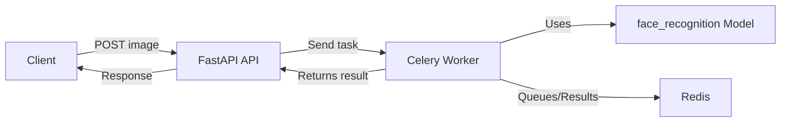

# FACE_RECOGNIZE

A project for facial recognition.

## Features

- Detect and recognize faces in images
- Easy integration and usage
- Asynchronous processing with Celery and Redis
- REST API with FastAPI

## Technologies Used

- **FastAPI**: For building the RESTful API endpoints.
- **Celery**: For handling background tasks (asynchronous processing).
- **Redis**: Used as a message broker for Celery.
- **face_recognition**: Python library for face detection and recognition.
- **Python**: Core programming language.

## Data Flow

1. **Client Request**:  
   The client sends an image (or image path) to the FastAPI endpoint.

2. **API Handling**:  
   FastAPI receives the request and validates the input.

3. **Task Queuing**:  
   The API submits a face recognition task to Celery, which is queued in Redis.

4. **Background Processing**:  
   Celery worker picks up the task, processes the image using the face_recognition model, and performs detection/recognition.

5. **Response**:  
   Once processing is complete, the result (recognized faces, metadata, etc.) is returned to the client, either synchronously or via a result endpoint.

## Example Workflow



## Installation

```bash
pip install -r requirements.txt
```

## Running the Project

1. **Start Redis Server**  
   Make sure Redis is running on your system.

2. **Start Celery Worker on windows (test only)**  
   ```bash
   celery -A app.tasks worker --loglevel=info --pool=solo
   ```
   ***OR***

3. **Start Celery Workers**  
   ```bash
   celery -A app.tasks worker --loglevel=info
   ```

4. **Run FastAPI App**  
   ```bash
   uvicorn app.main:app --reload --host 0.0.0.0 --port 8001
   ```


Send a POST request to the API endpoint (e.g., `/recognize`) with your image.

## License

MIT License